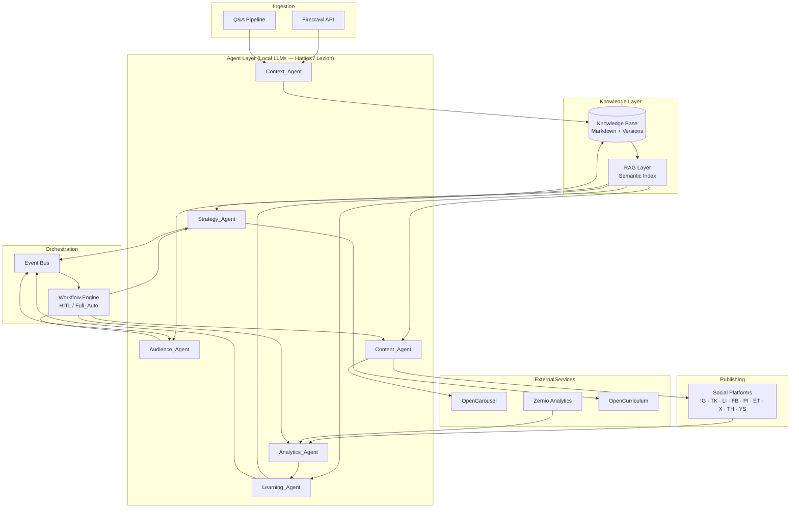
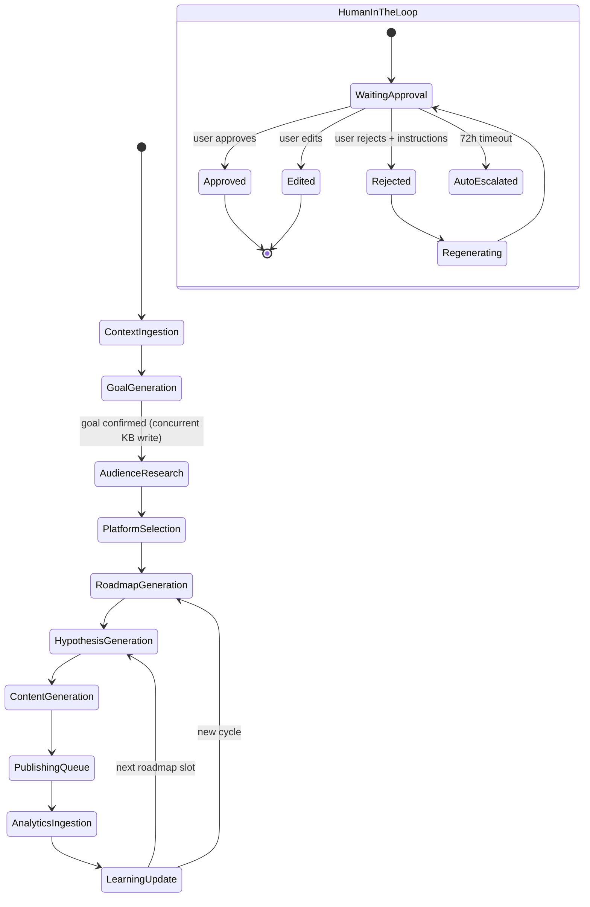
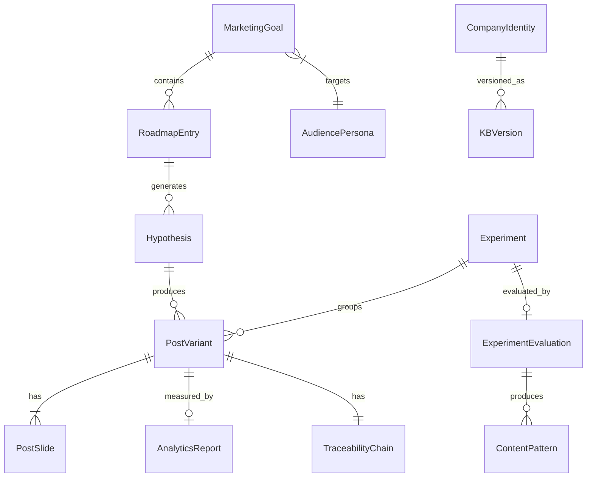

# Design Document: AI-Powered Social Content Experimentation Platform (`content-creator-ai`)

## Overview

The platform is a continuous-learning content operating system that orchestrates six AI agents to create, test, evaluate, and refine social media content through structured hypothesis-driven experimentation. It ingests company context via Firecrawl, builds a persistent versioned Knowledge Base (KB), generates structured Hypotheses, produces Post_Variants via OpenCarousel, publishes to nine social platforms, ingests analytics from Zernio, evaluates A/B experiments, and feeds learnings back into the KB — all with support for fully autonomous and human-supervised execution modes.

### Key Design Goals
- **Persistence & versioning**: Every KB write is immutable and append-only; history is never deleted.
- **Agent autonomy with human oversight**: Six specialised agents coordinate through a shared event bus; humans may intercept at configurable checkpoints.
- **Retrieval-augmented generation**: All agent outputs are grounded in semantically retrieved KB passages.
- **Statistical rigour**: Experiment evaluation uses 95 % confidence significance testing on `engagement_rate`.
- **Resilience**: Every external integration has a defined retry/fallback contract.


---

## Architecture

### High-Level System Diagram




### Layered Architecture

| Layer | Responsibility |
|---|---|
| **Ingestion Layer** | Firecrawl scraping + Q&A fallback pipeline; feeds raw content to Context_Agent |
| **Agent Layer** | Six specialised agents executed via local LLMs (Hatties / Lezion) |
| **Knowledge Layer** | Markdown KB files + semantic RAG index (vector store) |
| **Orchestration Layer** | Event Bus + Workflow Engine managing agent sequencing and HITL checkpoints |
| **External Services** | OpenCarousel, Zernio, OpenCurriculum — each wrapped by an adapter with retry logic |
| **Publishing Layer** | Platform adapters for 9 social networks with constraint validators |
| **API / UI Layer** | REST API for operator interactions; streaming SSE for real-time progress |

### Operating Mode Finite State Machine




---

## Components and Interfaces

### 1. Context_Agent

**Responsibility**: Firecrawl ingestion, Q&A pipeline, KB population, RAG indexing.

**Interface**:
```typescript
interface ContextAgentInput {
  companyUrl?: string;              // triggers Firecrawl path
  freeTextEnrichment?: string;      // triggers merge path
  userEdits?: Partial<CompanyIdentity>; // triggers edit path
}

interface ContextAgentOutput {
  companySummary: CompanyIdentity;
  kbVersion: string;                // new version ID after write
  scrapedPageCount: number;
  durationMs: number;
  status: "success" | "partial" | "firecrawl_error" | "no_change";
  warnings?: string[];
}
```

**Firecrawl integration**:
- Adapter: `FirecrawlAdapter` — wraps Firecrawl REST API
- Limit: 20 pages OR 60 seconds, whichever first; enforced client-side with AbortController
- On error: emit `firecrawl.error` event; present user with retry | Q&A options; non-blocking
- Precedence merge: deep merge where `userProvidedValues` keys overwrite scraped values

**Q&A Pipeline**: Stateful question sequence (10 prompts max) implemented as a finite conversation chain using the local LLM. Fields: company name → industry → mission → products → brand voice → values → target outcome.

---

### 2. Strategy_Agent

**Responsibility**: Goal generation, OpenCurriculum roadmap, RAG-informed Hypothesis generation.

**Interface**:
```typescript
interface StrategyAgentHypothesisInput {
  roadmapEntry: RoadmapEntry;
  ragContext: RAGPassage[];         // min 3 prior outcomes required
  marketingGoal: MarketingGoal;
  audiencePersonas: AudiencePersona[];
}

interface Hypothesis {
  id: string;                       // globally unique UUID
  hook: string;
  angle: string;
  coreCopy: string;
  painPoint: string;
  theme: string;
  visualTheme: string;
  successMetrics: SuccessMetric[];  // min 1, each with name + target value
  roadmapEntryId: string;
  goalId: string;
  status: "draft" | "approved" | "rejected" | "modified";
  kbStorageStatus: "persisted" | "failed";
  createdAt: string;
  versions: HypothesisVersion[];
}
```

**RAG precondition**: Before generating a Hypothesis, query RAG for prior outcomes. If fewer than 3 results returned, wait for KB to have sufficient history; on first experiment cycle, proceed with available context and skip precondition.

**OpenCurriculum integration**:
- Adapter: `OpenCurriculumAdapter`
- Input: `{ goal, personas, durationWeeks: 2..12 }`
- Output: `RoadmapEntry[]` — each entry has week number, theme, hypothesis slot
- Roadmap scheduling is **blocked** until KB storage of goal is confirmed


---

### 3. Audience_Agent

**Responsibility**: ICP research, persona proposal (2–5, <60% overlap), merge/validation.

**Interface**:
```typescript
interface AudiencePersona {
  id: string;
  icpDefinition: string;
  painPoints: string[];             // min 1 required
  jobsToBeDone: string[];
  objections: string[];
  dreamOutcomes: string[];
  source: "ai_generated" | "user_created" | "merged";
  kbVersion: string;
  createdAt: string;
}

type OverlapScore = number;         // 0.0 – 1.0; must be < 0.6 between any pair

interface PersonaMergeResult {
  merged: AudiencePersona;
  sourceIds: [string, string];
}
```

**Overlap detection**: Field-level Jaccard similarity across all string fields, computed pairwise. Alert user if any pair reaches ≥ 0.6. Merge produces union of unique field values; merged persona re-validated against minimum requirements.

**Concurrency**: Audience research starts immediately when goal is confirmed; goal KB write runs in parallel (non-blocking).

---

### 4. Content_Agent

**Responsibility**: OpenCarousel generation, platform constraint validation, brand context via RAG.

**OpenCarousel integration (key design)**:

The Content_Agent communicates with the local OpenCarousel instance (Next.js app at `localhost:3000`). It:
1. Creates a carousel via `POST /api/carousels` with name derived from Hypothesis ID and aspect ratio mapped from target platform.
2. Applies Hypothesis fields (Hook, Angle, Visual_Theme, Core_Copy, CTA) plus brand context (retrieved from RAG) via `PUT /api/brand` and the chat endpoint `POST /api/chat`.
3. Iterates slide generation (1–10 slides per variant, stored as HTML body fragments).
4. Sets caption + hashtags via `PUT /api/carousels/{id}`.
5. Exports via `POST /api/carousels/{id}/export` — returns PNG ZIP.

```typescript
interface PostVariant {
  id: string;                       // globally unique UUID
  hypothesisId: string;
  platform: SocialPlatform;
  carouselId: string;               // OpenCarousel carousel ID
  slides: PostSlide[];              // min 1 required
  caption: string;                  // required
  hashtags: string[];
  cta?: string;                     // optional
  aspectRatio: AspectRatio;
  brandContextTag?: "generated_without_brand_context";
  humanEditTag?: "human_edited";
  regenerationRetryCount: number;   // max 3 after human edit
  validationStatus: "valid" | "invalid";
  status: "draft" | "queued" | "published" | "failed" | "retained";
  publishedAt?: string;
  retainUntil?: string;             // now + 30 days on failure
  traceability: TraceabilityChain;
}

interface PostSlide {
  id: string;
  html: string;                     // body-level HTML fragment
  order: number;
  hasImage: boolean;
  hasText: boolean;
}
```

**Platform aspect ratio mapping**:

| Platform | Aspect Ratio | Caption limit | Hashtag policy |
|---|---|---|---|
| Instagram | 4:5 (recommended) | 2,200 chars | ≤ 30 tags |
| TikTok | 9:16 | 2,200 chars | ≤ 30 tags |
| LinkedIn | 1:1 or 4:5 | 3,000 chars | ≤ 30 tags |
| Facebook | 1:1 or 4:5 | 63,206 chars | No policy |
| Pinterest | 2:3 (use 4:5) | 500 chars | No strict limit |
| Etsy | 1:1 | 300 chars | N/A |
| X (Twitter) | 1:1 or 16:9 | 280 chars | ≤ 10 tags |
| Threads | 1:1 | 500 chars | ≤ 10 tags |
| YouTube Shorts | 9:16 | 5,000 chars | ≤ 15 tags |


---

### 5. Analytics_Agent

**Responsibility**: Zernio polling, statistical significance (95%), winner identification, Learning_Agent trigger.

**Interface**:
```typescript
interface AnalyticsReport {
  postVariantId: string;
  hypothesisId: string;
  experimentId: string;
  observationWindowDays: number;    // 1–30, default 7
  metrics: ZernioMetrics;
  ingestStatus: "complete" | "partial" | "error";
  retryCount: number;               // max 3 before user notification
  ingestedAt: string;
}

interface ZernioMetrics {
  impressions: number;
  ctr: number;
  saves: number;
  shares: number;
  comments: number;
  watchTime: number;
  conversions: number;
  engagementRate: number;           // primary comparator
  followerGrowth: number;
}

interface ExperimentSignificanceResult {
  experimentId: string;
  winningVariantId: string;
  determinationMethod: "statistically_significant" | "highest_absolute";
  confidenceLevel: number;          // 0.95 threshold
  conclusive: boolean;
  evaluatedAt: string;
}
```

**Statistical significance**: Welch's t-test on `engagementRate` across all variants. Threshold: p < 0.05 (95% confidence). If significance reached with a clear winner → `determinationMethod: statistically_significant`. If significant overall but no single dominant winner → highest absolute `engagementRate` wins, `determinationMethod: highest_absolute`.

**Zernio polling**: Triggered after `observationWindowDays` from publish timestamp. On partial data (< 5 of 9 metrics) → log error, schedule retry in 1 hour. After 3 retries → notify user.

---

### 6. Learning_Agent

**Responsibility**: Experiment_Evaluation, outcome classification, atomic KB update + event emission.

**Interface**:
```typescript
interface ExperimentEvaluation {
  id: string;                       // globally unique UUID
  experimentId: string;
  evaluationTimestamp: string;
  postVariantOutcomes: PostVariantOutcome[];
  winningPatterns: ContentPattern[];
  failedPatterns: ContentPattern[];
  audienceLearnings: string[];
  hookPerformance: HookPerformanceRecord[];
}

interface PostVariantOutcome {
  postVariantId: string;
  classification: "exceeded_expectations" | "met_expectations" | "below_expectations" | "failed";
  // exceeded: > 20% above target
  // met:      within ±20% of target
  // below:    1–50% below target
  // failed:   > 50% below target
  observedValue: number;
  targetValue: number;
}

interface ContentPattern {
  patternId: string;
  type: "hook" | "angle" | "visual_theme";
  value: string;
  priorityScore: number;            // winning > 0.0; failed == 0.0
  experimentId: string;
  recencyWeight: number;            // computed from evaluationTimestamp
}
```

**Atomicity contract**: KB write + `knowledge_updated` event emission are a single logical transaction. If event emission fails after up to 3 retries (60s acknowledgement window each) → roll back KB write → log failure. If KB write fails → do not emit event.

**Version numbering**: Monotonically incrementing integer per `experimentId`. Implemented as a per-experiment sequence counter stored alongside the experiment record.


---

### 7. Workflow Engine

**Responsibility**: Sequencing agents, managing HITL checkpoints, mode switching.

**Approval_Checkpoint stages**:
```
ContextReview | GoalReview | AudienceReview | RoadmapReview |
HypothesisReview | ContentReview | PublishingApproval |
ExperimentReview | NextIterationPlanning
```

**Rules enforced by the Workflow Engine**:
- HITL mode: minimum 1 checkpoint always enabled; block disable of last active checkpoint.
- If all checkpoints become disabled (bulk-disable bypass) → auto-switch to Full_Auto_Mode + notify user.
- Mode switch applies from the next incomplete stage only; previously approved outputs are unaffected.
- Checkpoint timeout: 72 hours → auto-escalate + notify.
- Rejection: requires regeneration instructions (free-text) OR manual replacement; bare rejection blocked.

---

### 8. Knowledge Base (KB)

**Markdown schema** (top-level sections):

```markdown
# Company_Identity
## Mission | Vision | BrandVoice | Values | Products | Features | Benefits | Pricing

# Products
## [ProductName]
### Features | Benefits | Pricing | TargetAudience

# Audiences
## [PersonaID]
### ICPDefinition | PainPoints | JobsToBeDone | Objections | DreamOutcomes

# Experiments
## [ExperimentID]
### Hypothesis | PostVariantIDs | PublishedDates | AnalyticsResults
### StatisticalSignificance | LessonsLearned | WinningPatterns | FailedPatterns
```

**Versioning**: Every write creates a new snapshot file: `{entity_id}_v{n}.md`. The latest version is symlinked / referenced as `{entity_id}_current.md`. Snapshots are write-once; modification or deletion is rejected at the storage layer.

**Re-indexing**: After any KB write is confirmed, a `kb.updated` event triggers the RAG indexer to re-process affected documents. Target: ≤ 60 seconds to full index refresh.

---

### 9. RAG Layer

**Technology**: Embedding model (local, e.g. `nomic-embed-text` via Ollama) + vector store (e.g. ChromaDB or `hnswlib` for local-first deployment). Semantic similarity search returns cosine similarity ranked results.

**Retrieval scopes**:
- `product_context` — Products section of KB
- `company_memory` — Company_Identity section
- `experiment_history` — Experiments section
- `audience_learning` — Audiences section

**Query contract**:
- Input: `{ query: string, scope?: RetrievalScope, k?: number }` (default k=5)
- Output: `RAGPassage[]` — each with `content`, `source_doc`, `similarity_score`, `scope`
- SLA: ≤ 3 seconds p95 for indexes ≤ 10,000 chunks
- On zero results / unavailability: return `[]`; caller tags output as `"generated without retrieved context"`


---

## Data Models

### Core Entity Relationships



### Key Types

```typescript
// ---- Traceability ----
interface TraceabilityChain {
  companyContextVersionId: string;
  marketingGoalId: string;
  audiencePersonaId: string;
  roadmapEntryId: string;
  hypothesisId: string;
  postVariantId: string;
  publishedRecordId?: string;
  analyticsReportId?: string;
  experimentEvaluationId?: string;
  status: "complete" | "partial" | "in_progress";
  links: TraceabilityLink[];
}

interface TraceabilityLink {
  entityType: string;
  entityId: string;
  timestamp: string;
}

// ---- KB Version ----
interface KBVersion {
  versionId: string;
  entityId: string;
  entityType: string;
  versionNumber: number;            // monotonically incrementing
  snapshotPath: string;             // path to immutable .md file
  priorValues: Record<string, unknown>;
  modifiedFields: string[];
  timestamp: string;
  author: "system" | "user";
}

// ---- Marketing Goal ----
interface MarketingGoal {
  id: string;
  primaryObjective: string;
  targetPlatform: SocialPlatform;
  successMetrics: SuccessMetric[];  // min 1
  status: "proposed" | "accepted" | "modified" | "replaced";
  kbVersion: string;
  createdAt: string;
}

interface SuccessMetric {
  name: string;
  numericTarget: number;
  timePeriod: string;               // e.g. "30d", "Q3 2025"
  direction: "increase" | "decrease" | "maintain";
}

// ---- Roadmap ----
interface ExperimentationRoadmap {
  id: string;
  goalId: string;
  durationWeeks: number;            // 2–12
  entries: RoadmapEntry[];
  kbStorageStatus: "confirmed" | "pending" | "failed";
  createdAt: string;
}

interface RoadmapEntry {
  id: string;
  weekNumber: number;
  theme: string;
  hypothesisSlot: string | null;    // null until scheduled
  businessObjectiveRef: string;
  successMetrics: SuccessMetric[];
  status: "pending" | "active" | "completed";
}

// ---- Publishing ----
type SocialPlatform =
  | "instagram" | "tiktok" | "linkedin" | "facebook"
  | "pinterest" | "etsy" | "x" | "threads" | "youtube_shorts";

interface PublishRecord {
  id: string;
  postVariantId: string;
  hypothesisId: string;
  platform: SocialPlatform;
  scheduledAt: string;
  publishedAt?: string;
  status: "queued" | "published" | "failed" | "retrying";
  retryAttempts: number;            // max 3
  retainUntil?: string;             // failed variants: now + 30d
}
```


---

## Correctness Properties

*A property is a characteristic or behavior that should hold true across all valid executions of a system — essentially, a formal statement about what the system should do. Properties serve as the bridge between human-readable specifications and machine-verifiable correctness guarantees.*

---

### Property 1: User-Provided Values Always Take Precedence in KB Merge

*For any* KB state and any user-provided enrichment input containing one or more field values, after the merge operation the resulting KB entry must contain the user-provided values for all conflicting fields, and must preserve all non-conflicting existing KB fields unchanged.

**Validates: Requirements 1.2, 1.3**

---

### Property 2: Company Summary Always Contains Required Structural Fields

*For any* scraped content returned by Firecrawl (regardless of content length, language, or page count), the structured company summary produced by Context_Agent must contain at minimum: company name, mission, brand voice, and at least one product entry.

**Validates: Requirement 1.5**

---

### Property 3: KB Edit Always Creates a Version Record With Prior Values

*For any* KB entity and any edit operation, the resulting KB state must contain a new version record capturing the timestamp and the prior values of every modified field; the entity's current state must reflect the new values.

**Validates: Requirements 1.6, 2.2**

---

### Property 4: Rejection Never Mutates the KB

*For any* KB state, executing a rejection action (of a summary, hypothesis, or persona draft) must leave the KB byte-for-byte identical to its pre-rejection state.

**Validates: Requirements 1.7, 7.7**

---

### Property 5: KB Markdown Serialisation Preserves Required Sections

*For any* valid KB entity (CompanyIdentity, Product, Audience, or Experiment), serialising it to Markdown and parsing the result must produce a document with all four top-level sections (Company_Identity, Products, Audiences, Experiments) present and non-empty for populated entities.

**Validates: Requirement 2.1**

---

### Property 6: Version History Is Append-Only and Monotonically Ordered

*For any* sequence of KB mutations applied to the same entity, the version chain must: (a) never shrink in length, (b) assign strictly increasing version numbers, and (c) contain every prior state of the entity in order.

**Validates: Requirements 2.2, 11.7**

---

### Property 7: RAG Returns At Most k Results, All From Indexed Content

*For any* query and any indexed KB state with n documents, the RAG Layer must return min(n, k) results, and every returned passage must be a substring of at least one indexed document.

**Validates: Requirement 2.3**

---

### Property 8: Generated Goals Always Include Objective, Platform, and At Least One Measurable Metric

*For any* valid KB context containing company name, industry, and at least one business objective, the goal generated by Strategy_Agent must include a non-empty primary objective, a target platform, and at least one SuccessMetric with a numeric target and a time period.

**Validates: Requirements 3.1, 3.4**

---

### Property 9: Goal Validation Rejects Any Goal Missing Required Fields

*For any* goal object, the validation function must return `valid` if and only if the goal contains a non-empty `primaryObjective` and at least one `SuccessMetric` with a `numericTarget` and `timePeriod`; for all other inputs it must return `invalid`.

**Validates: Requirements 3.4, 3.5, 3.6**

---

### Property 10: Proposed Persona Sets Are Distinct (<60% Pairwise Overlap)

*For any* confirmed marketing goal, the Audience_Agent's proposed persona set must contain between 2 and 5 personas, and for every pair of personas in the set the field-level Jaccard similarity score must be strictly less than 0.6.

**Validates: Requirement 4.1**

---

### Property 11: Persona Validation Rejects Submissions Missing Required Fields

*For any* persona object, the validation function must return `valid` if and only if the persona has a non-empty `icpDefinition` and at least one entry in `painPoints`; all other inputs must be rejected with an indication of which fields are missing.

**Validates: Requirement 4.5**

---

### Property 12: Persona Overlap Alert Fires Exactly When Overlap ≥ 60%

*For any* pair of personas, the overlap detection function must emit an alert if and only if the computed field-level Jaccard similarity is ≥ 0.6.

**Validates: Requirement 4.6**

---

### Property 13: Merged Persona Is the Union of Unique Fields From Both Sources

*For any* two valid personas A and B, the merged persona must contain every field present in A and every field present in B, with no field from either source omitted, and the result must pass minimum persona validation.

**Validates: Requirement 4.7**

---

### Property 14: Platform Content Validation Flags All Constraint Violations

*For any* (content, platform) pair, the platform validator must flag the content if and only if at least one of the following violations is present: aspect ratio mismatch, caption length exceeds platform limit, hashtag count exceeds policy, CTA placement violates platform rules.

**Validates: Requirement 5.3**

---

### Property 15: Generated Roadmap Satisfies Structural Invariants

*For any* confirmed goal and approved persona set, the roadmap generated by Strategy_Agent via OpenCurriculum must: (a) span between 2 and 12 weeks, (b) contain at least one Hypothesis slot per scheduled week, and (c) link each Hypothesis to a business objective with at least one SuccessMetric.

**Validates: Requirements 6.1, 6.2**

---

### Property 16: Generated Hypothesis Always Contains All Seven Required Fields With Valid Success Metrics

*For any* experiment slot context, the Hypothesis generated by Strategy_Agent must contain non-empty values for all seven fields (Hook, Angle, Core_Copy, Pain_Point, Theme, Visual_Theme, Success_Metrics) and at least one SuccessMetric with a non-empty metric name and a non-null target value.

**Validates: Requirement 7.1**

---

### Property 17: Hypothesis Generation Does Not Proceed With Fewer Than 3 Prior Outcomes

*For any* RAG query result set containing fewer than 3 prior experiment outcomes, the Hypothesis generation step must not produce a final Hypothesis and must instead wait or indicate insufficient history (exception: first experiment cycle with zero prior outcomes).

**Validates: Requirement 7.2**

---

### Property 18: Hypothesis Modification Preserves Original as a Versioned Alternative

*For any* hypothesis and any modification operation, the resulting state must contain the modified values as the current version and must retain the original field values and creation timestamp as an immutable versioned alternative.

**Validates: Requirement 7.6**

---

### Property 19: Post_Variant Count Per Platform Is Always Between 2 and 5

*For any* approved Hypothesis and any selected platform, the number of Post_Variants generated by Content_Agent must be in the closed interval [2, 5].

**Validates: Requirement 8.1**

---

### Property 20: Post_Variant Validation Accepts Exactly the Correct Structure

*For any* Post_Variant object, the validation function must return `valid` if and only if: (a) at least one slide is present, (b) every slide contains either a non-empty image reference or non-empty text, and (c) the caption field is non-empty. An absent or empty CTA must not affect the result.

**Validates: Requirement 8.4**

---

### Property 21: Human-Edited Variants Are Always Tagged and Retry Count Is Bounded

*For any* Post_Variant that undergoes a human edit operation, the resulting variant must carry the `human_edited` tag in the experiment record, and the regeneration retry counter for that variant must never exceed 3.

**Validates: Requirement 8.9**

---

### Property 22: Outcome Classification Always Matches the Defined Thresholds

*For any* (observed_value, target_value) numeric pair, the classification function must return:
- `exceeded_expectations` iff `observed > target * 1.20`
- `met_expectations` iff `observed >= target * 0.80 && observed <= target * 1.20`
- `below_expectations` iff `observed >= target * 0.50 && observed < target * 0.80`
- `failed` iff `observed < target * 0.50`

**Validates: Requirement 11.2**

---

### Property 23: Winner Identification Always Uses Engagement Rate as Primary Comparator

*For any* Experiment where statistical significance is reached (p < 0.05), the winning PostVariant must be the one with the strictly highest `engagementRate`, and the `determinationMethod` field must be recorded as either `statistically_significant` or `highest_absolute` per the tie-breaking rule.

**Validates: Requirements 10.3, 10.4**

---

### Property 24: Evaluation Version Records Always Contain All Required Fields

*For any* completed ExperimentEvaluation, the KB version record written by Learning_Agent must contain non-null values for: Experiment_ID, Evaluation_Timestamp, classification for each PostVariant, winning patterns, failed patterns, and pattern attributes.

**Validates: Requirement 11.3**

---

### Property 25: Priority Scores Respect the Winning/Failed Rule

*For any* ContentPattern tagged as a winning pattern, its `priorityScore` must be strictly greater than 0.0. *For any* ContentPattern tagged as a failed pattern, its `priorityScore` must be exactly 0.0.

**Validates: Requirements 11.4, 11.5**

---

### Property 26: KB Update and Event Emission Are Atomic

*For any* Learning_Agent KB update operation, the final observable state must be one of exactly two outcomes: (a) both the KB write and the `knowledge_updated` event are committed, or (b) neither is committed (full rollback). No partial state (KB written but event not emitted, or event emitted without KB write) must ever be observable.

**Validates: Requirement 11.6**

---

### Property 27: HITL Mode Always Has At Least One Enabled Checkpoint

*For any* sequence of checkpoint enable/disable operations in Human_In_The_Loop_Mode, the number of enabled checkpoints must never reach zero; any operation that would reduce the count to zero must be rejected and the checkpoint count must remain ≥ 1.

**Validates: Requirements 12.9, 12.10**

---

### Property 28: Traceability Chain Contains All Required Links for Any Post_Variant

*For any* Post_Variant at any lifecycle stage, the traceability chain must contain entries for every link that exists up to that stage (companyContextVersion → goal → persona → roadmapEntry → hypothesis → postVariant → publishedRecord → analyticsReport → evaluation), each with a non-null entity ID and timestamp; unreached links must be absent and the chain status must be `in_progress` or `partial`.

**Validates: Requirements 13.1, 13.2, 13.4, 13.5**

---

### Property 29: RAG Passage Count Is Always min(available, 5)

*For any* RAG result set of size n (where n ≥ 0), the number of passages incorporated into a generation prompt must equal min(n, 5). Specifically, if n = 0 the agent must proceed without context and apply the `"generated without retrieved context"` tag.

**Validates: Requirements 14.2, 14.6**


---

## Error Handling

### External Integration Failures

| Integration | Failure Mode | Handling |
|---|---|---|
| Firecrawl | Error / unreachable URL | Notify user; offer retry or Q&A pipeline; non-blocking to other operations |
| Firecrawl | Partial scrape (< 20 pages or hit 60s limit) | Proceed with partial data; log page count and duration; surface in summary |
| OpenCarousel | Generation error | Log error; notify user; allow retry or manual content input |
| OpenCarousel | RAG unavailable at generation time | Proceed with Hypothesis fields only; tag variant as `"generated_without_brand_context"` |
| Zernio | Error or incomplete data (< 5/9 metrics) | Log error; retry after 1 hour; notify user after 3 failed retries |
| OpenCurriculum | Generation error | Notify user; allow retry with adjusted parameters |
| Local LLM | Inference timeout | Retry up to 3 times with exponential backoff; fall back to error notification |

### Publishing Failures

Exponential backoff retry schedule for platform API errors:
- Attempt 1: immediate
- Attempt 2: +1 minute
- Attempt 3: +2 minutes
- Attempt 4: +4 minutes (final)

After 4 total attempts → mark PostVariant as `failed`, retain for 30 days, notify user.

### Knowledge Base Failures

- **Hypothesis KB storage failure**: Non-blocking — approval proceeds; warning displayed; retry attempted in background.
- **Goal KB storage failure**: Blocking — roadmap scheduling held until storage confirmed.
- **Learning_Agent KB write failure**: Atomic rollback — event not emitted; failure logged.
- **Event emission failure (after KB write)**: Rollback KB write; log failure with Experiment_ID; fall back to failure log after 3 retries.

### Approval Checkpoint Failures

- **72-hour timeout**: Auto-escalate; notify user; preserve pending outputs; workflow continues in Full_Auto_Mode for that item only.
- **Rejection without instructions**: Blocked — system requires either free-text regeneration instructions or manual replacement before accepting rejection.

### Validation Failures

- **Invalid PostVariant** (missing slide with image/text, or missing caption): Discard invalid variant; preserve all valid variants; notify user of discarded count.
- **Invalid persona** (missing ICP or pain point): Reject submission; list missing fields; do not write partial data.
- **Invalid goal** (missing objective or metric): Request required fields before storing; do not advance workflow.


---

## Testing Strategy

### Overview

The platform uses a **dual testing approach**:
- **Property-based tests (PBT)**: Verify universal invariants across generated inputs (Properties 1–29 above).
- **Unit / example-based tests**: Verify specific scenarios, error conditions, and integration boundaries.
- **Integration tests**: Verify external service wiring and timing SLAs.
- **Smoke tests**: Verify environment setup and infrastructure configuration.

PBT is appropriate here because the platform contains substantial pure business logic: field-level merge precedence, validation predicates, classification thresholds, overlap detection, version ordering, cardinality constraints, and traceability chain completeness — all of which are universal properties that benefit from 100+ randomised iterations.

---

### Property-Based Testing

**Library**: [fast-check](https://github.com/dubzzz/fast-check) (TypeScript/JavaScript ecosystem, compatible with Next.js + Vitest).

**Configuration**: Minimum **100 runs** per property. Each test is tagged with:

```
// Feature: content-creator-ai, Property N: <property_text>
```

**Test file structure**:
```
tests/
  pbt/
    kb-merge.pbt.test.ts          # Properties 1, 3, 4, 5, 6
    rag-retrieval.pbt.test.ts     # Properties 7, 29
    goal-validation.pbt.test.ts   # Properties 8, 9
    persona.pbt.test.ts           # Properties 10, 11, 12, 13
    platform-validation.pbt.test.ts # Property 14
    roadmap.pbt.test.ts           # Property 15
    hypothesis.pbt.test.ts        # Properties 16, 17, 18
    post-variant.pbt.test.ts      # Properties 19, 20, 21
    analytics.pbt.test.ts         # Properties 22, 23
    learning-agent.pbt.test.ts    # Properties 24, 25, 26
    workflow-engine.pbt.test.ts   # Property 27
    traceability.pbt.test.ts      # Property 28
```

**Example property test** (Property 22 — outcome classification):

```typescript
// Feature: content-creator-ai, Property 22: Outcome classification matches defined thresholds
import fc from "fast-check";
import { classifyOutcome } from "@/lib/learning-agent";

test("classifyOutcome matches all threshold boundaries", () => {
  fc.assert(
    fc.property(
      fc.float({ min: 0, max: 1000 }),  // observed
      fc.float({ min: 1, max: 1000 }),  // target (non-zero)
      (observed, target) => {
        const result = classifyOutcome(observed, target);
        if (observed > target * 1.2) return result === "exceeded_expectations";
        if (observed >= target * 0.8) return result === "met_expectations";
        if (observed >= target * 0.5) return result === "below_expectations";
        return result === "failed";
      }
    ),
    { numRuns: 100 }
  );
});
```

**Example property test** (Property 6 — monotonic version history):

```typescript
// Feature: content-creator-ai, Property 6: Version history is append-only and monotonically ordered
import fc from "fast-check";
import { applyKBMutation, getVersionChain } from "@/lib/knowledge-base";

test("KB version numbers are strictly increasing and chain never shrinks", () => {
  fc.assert(
    fc.property(
      fc.array(fc.record({ field: fc.string(), value: fc.string() }), { minLength: 1, maxLength: 20 }),
      (mutations) => {
        const entityId = "test-entity";
        let chain = getVersionChain(entityId);
        const initialLength = chain.length;
        for (const mutation of mutations) {
          applyKBMutation(entityId, mutation);
          const newChain = getVersionChain(entityId);
          // Chain must grow
          if (newChain.length <= chain.length) return false;
          // Version numbers must be strictly increasing
          for (let i = 1; i < newChain.length; i++) {
            if (newChain[i].versionNumber <= newChain[i - 1].versionNumber) return false;
          }
          chain = newChain;
        }
        return chain.length >= initialLength + mutations.length;
      }
    ),
    { numRuns: 100 }
  );
});
```

---

### Unit / Example-Based Tests

Focus areas:
- **Firecrawl error path**: Single test verifying retry | Q&A options presented on error; non-blocking assertion.
- **RAG unavailability tag**: Per-agent test verifying `"generated without retrieved context"` tag applied when RAG returns `[]`.
- **HITL checkpoint auto-escalation**: Mock timer at 72h; verify auto-escalation event and user notification.
- **Publishing retry schedule**: Verify 1min → 2min → 4min backoff intervals and failure state after 4 attempts.
- **Partial Zernio data** (< 5 metrics): Verify retry scheduling and user notification after 3 failures.
- **Hypothesis KB storage failure**: Verify approval proceeds + warning displayed.
- **Goal KB storage failure**: Verify roadmap scheduling is blocked.
- **Mode switch preserves prior approvals**: Verify switching Full_Auto ↔ HITL only affects next incomplete stage.
- **Rejection blocked without instructions**: Verify rejection with empty instructions is rejected.
- **Q&A pipeline progression**: Verify 10-step question chain produces a complete CompanyIdentity.

---

### Integration Tests

| Scenario | Coverage |
|---|---|
| Firecrawl full scrape round-trip | Req 1.1, 1.2 |
| RAG query latency ≤ 3s at 10k chunks | Req 2.4 |
| RAG re-index within 60s after KB write | Req 14.4 |
| OpenCarousel carousel → PNG export | Req 8.2, 8.3 |
| Zernio analytics polling on observation window expiry | Req 10.1, 10.2 |
| OpenCurriculum roadmap generation end-to-end | Req 6.1 |
| Publishing retry with platform API mock | Req 9.5 |
| knowledge_updated event acknowledgement within 60s | Req 11.6 |
| Traceability chain query latency ≤ 3s | Req 13.2 |

---

### Smoke Tests

- Local LLM (Hatties / Lezion) reachable at configured endpoint
- OpenCarousel Next.js app running at `localhost:3000`
- Vector store (RAG) initialised and queryable
- KB file storage directory writable with correct permissions
- All 9 platform publishing adapters initialised without error
- Zernio API credentials valid

